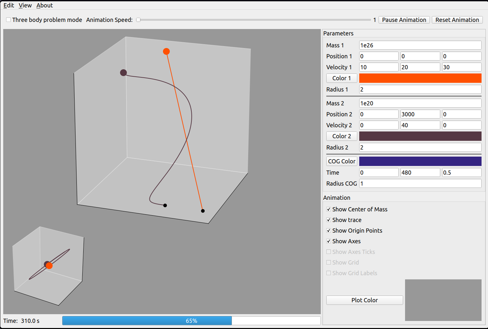

# two-body-problem-gui
A GUI program written in Python to play around with parameters with ease in a two body problem.

# Libraries Used

1. PyQt6
2. Numpy
3. Matplotlib
4. Scipy

# How to run the program ?

Just execute `python plot_gui_multiple.py` or `python plot_gui.py` for the initial v1.0 version.

# Why are there two programs ?

`plot_gui.py` is the v1.0 that has single plot describing the motion of the two bodies. But `plot_gui_multiple.py` has
two plots, one describing the motion of the two bodies with respect to a third observer watching the two bodies, second one
describing the motion of one of the body with respect to the other.

# Screenshot

# TODO

Check (TODO)[TODO.md]
